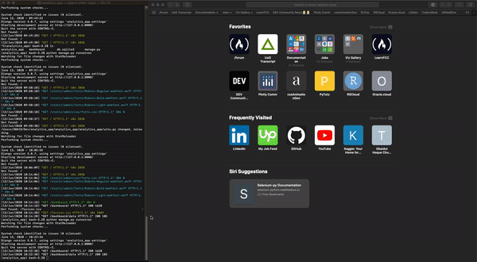

# Creating a Django virtual environment
1. Create a dedicated directory for virtual environment in terminal or powershell
`mkdir project_name `
2. Go to the created folder
`cd project_name`
3. Activate the virtual environment (make sure to install python package bundler `pipenv`)
`pipenv shell`
4. Make sure to install Django only after activating the virtual environment
`pipenv install django==3.0.3`

# Flex monster Web Reporting
Flexmonster is an amazing JS framework for deploying web reporting tools such as pivot tables, pie charts etc. 

# Future projects using Django
Plan is to create analytics dashboard using plotly's graphing library in Django application. 

# The Django Dashboard Application

[Analytics App Repository](https://github.com/obaidhoque/django_analytics_app)
